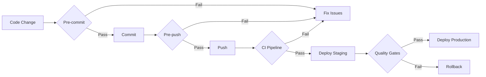

# Performance Budgets & Quality Gates Specification

**Version:** 1.0  
**Created:** January 14, 2025  
**Based on:** Performance baseline analysis, Risk assessment, Tailwind v4 spec
**Purpose:** Establish comprehensive performance budgets and automated quality gates

## Executive Summary

This specification defines strict performance budgets and automated quality gates for the Victry dark mode removal project. All metrics are based on 2025 web performance standards and enforce measurable improvements over the current baseline.

## Performance Budgets

### JavaScript Bundle Budgets

#### Per-Route Budgets
| Route Category | Current | Budget | Max Allowed | Enforcement |
|----------------|---------|--------|-------------|-------------|
| **Critical Routes** | 403 KB | 180 KB | 200 KB | Block deployment |
| **Standard Routes** | 150 KB | 100 KB | 130 KB | Block deployment |
| **Auth Routes** | 106 KB | 80 KB | 100 KB | Block deployment |
| **Static Routes** | 103 KB | 50 KB | 80 KB | Warning only |

#### Chunk Size Budgets
| Chunk Type | Current | Budget | Max Allowed | Action |
|------------|---------|--------|-------------|--------|
| **Main Chunks** | 372 KB | 150 KB | 200 KB | Split required |
| **Vendor Chunks** | Unknown | 100 KB | 150 KB | Tree-shake |
| **Async Chunks** | Unknown | 50 KB | 75 KB | Lazy load |

### CSS Bundle Budgets

| Metric | Current | Target | Budget | Enforcement |
|--------|---------|--------|--------|-------------|
| **Total CSS** | ~450 KB | 400 KB | 425 KB | Warning at 400KB |
| **Compressed CSS** | Unknown | 45 KB | 50 KB | Block >50KB |
| **Critical CSS** | ~18 KB | 12 KB | 14 KB | Block >14KB |
| **Route CSS** | Unknown | 8 KB | 10 KB | Warning >8KB |

### Core Web Vitals Budgets

| Metric | Good | Needs Improvement | Poor | Budget |
|--------|------|-------------------|------|--------|
| **LCP** | <2.5s | 2.5s-4.0s | >4.0s | <2.0s (p75) |
| **FID** | <100ms | 100ms-300ms | >300ms | <75ms (p75) |
| **CLS** | <0.1 | 0.1-0.25 | >0.25 | <0.05 (p75) |
| **FCP** | <1.8s | 1.8s-3.0s | >3.0s | <1.5s (p75) |
| **TTFB** | <0.8s | 0.8s-1.8s | >1.8s | <0.6s (p75) |
| **INP** | <200ms | 200ms-500ms | >500ms | <150ms (p75) |

### Build Performance Budgets

| Metric | Current | Budget | Max Allowed |
|--------|---------|--------|-------------|
| **Full Build** | 2000ms | 1000ms | 1500ms |
| **Incremental Build** | Unknown | 100ms | 200ms |
| **Type Check** | Disabled | 400ms | 500ms |
| **Lint** | Disabled | 300ms | 400ms |
| **Test Suite** | Unknown | 30s | 45s |

## Quality Gates

### Pre-Commit Gates

```yaml
# .husky/pre-commit
#!/bin/sh
. "$(dirname "$0")/_/husky.sh"

# Fast checks only (< 5 seconds total)
npm run validate:colors        # 0 hard-coded colors allowed
npm run lint:staged           # ESLint on staged files
npm run type-check:staged     # TypeScript on changed files
```

### Pre-Push Gates

```yaml
# .husky/pre-push
#!/bin/sh
. "$(dirname "$0")/_/husky.sh"

# Comprehensive checks (< 30 seconds)
npm run build                 # Ensure build succeeds
npm run test:unit            # Unit tests must pass
npm run bundle:analyze       # Check bundle budgets
npm run audit:accessibility  # WCAG compliance check
```

### CI/CD Pipeline Gates

#### Level 1: Fast Feedback (< 2 minutes)
```yaml
fast-checks:
  - validate:colors          # 0 violations required
  - lint:all                # 0 errors allowed
  - type-check             # 0 type errors
  - test:unit              # 100% pass rate
  - bundle:size-check      # Within budgets
```

#### Level 2: Comprehensive Testing (< 10 minutes)
```yaml
comprehensive-checks:
  - test:integration       # All integration tests
  - test:visual-regression # <5 pixel differences
  - test:accessibility     # WCAG AA compliance
  - lighthouse:ci          # Performance budgets
  - security:scan          # No vulnerabilities
```

#### Level 3: E2E & Performance (< 20 minutes)
```yaml
e2e-performance:
  - test:e2e:critical      # Critical user flows
  - test:e2e:full         # Complete test suite
  - performance:real-user  # RUM simulation
  - load:test             # Stress testing
```

### Deployment Gates

#### Staging Deployment Requirements
- [ ] All CI checks passing
- [ ] Visual regression approved
- [ ] Performance budgets met
- [ ] No critical security issues
- [ ] Migration checklist complete

#### Production Deployment Requirements
- [ ] Staging validation (24 hours minimum)
- [ ] Performance metrics improved or stable
- [ ] Error rate <0.1% in staging
- [ ] Load testing passed
- [ ] Rollback plan tested
- [ ] Team sign-off received

## Automated Enforcement

### Bundle Size Enforcement

```javascript
// scripts/check-bundle-size.js
const budgets = {
  routes: {
    '/resume/[id]/edit': { max: 200000, warn: 180000 },
    '/dashboard': { max: 130000, warn: 100000 },
    '/auth/*': { max: 100000, warn: 80000 },
    '/*': { max: 130000, warn: 100000 }
  },
  chunks: {
    'main': { max: 200000, warn: 150000 },
    'vendor': { max: 150000, warn: 100000 }
  },
  css: {
    total: { max: 51200, warn: 46080 }, // 50KB / 45KB
    critical: { max: 14336, warn: 12288 } // 14KB / 12KB
  }
};
```

### Performance Budget Enforcement

```javascript
// lighthouse.config.js
module.exports = {
  ci: {
    collect: {
      numberOfRuns: 3,
      url: ['http://localhost:3000/']
    },
    assert: {
      assertions: {
        'categories:performance': ['error', { minScore: 0.9 }],
        'categories:accessibility': ['error', { minScore: 1.0 }],
        'first-contentful-paint': ['error', { maxNumericValue: 1500 }],
        'largest-contentful-paint': ['error', { maxNumericValue: 2000 }],
        'cumulative-layout-shift': ['error', { maxNumericValue: 0.05 }],
        'total-blocking-time': ['error', { maxNumericValue: 150 }],
        'max-potential-fid': ['error', { maxNumericValue: 75 }],
        'resource-summary:script:size': ['error', { maxNumericValue: 200000 }],
        'resource-summary:stylesheet:size': ['error', { maxNumericValue: 50000 }]
      }
    },
    upload: {
      target: 'temporary-public-storage'
    }
  }
};
```

### Color Validation Enforcement

```javascript
// scripts/validate-colors.js
const violations = {
  forbidden: [
    /dark:/,                    // Dark mode classes
    /bg-(gray|slate|zinc)-/,   // Hard-coded grays
    /text-(gray|slate|zinc)-/, // Hard-coded grays
    /border-(gray|slate|zinc)-/, // Hard-coded grays
    /bg-(white|black)/,        // Hard-coded black/white
    /text-(white|black)/       // Hard-coded black/white
  ],
  required: [
    'bg-background',
    'text-foreground',
    'border-border'
  ]
};

// Exit code 1 if violations found
process.exit(violationCount > 0 ? 1 : 0);
```

## Monitoring & Alerting

### Real-Time Performance Monitoring

```javascript
// monitoring/performance-metrics.js
const thresholds = {
  // Page Load Metrics
  domContentLoaded: { warn: 1500, error: 2000 },
  firstPaint: { warn: 1000, error: 1500 },
  firstContentfulPaint: { warn: 1500, error: 2000 },
  largestContentfulPaint: { warn: 2000, error: 2500 },
  
  // Interactivity Metrics
  firstInputDelay: { warn: 75, error: 100 },
  interactionToNextPaint: { warn: 150, error: 200 },
  totalBlockingTime: { warn: 150, error: 300 },
  
  // Visual Stability
  cumulativeLayoutShift: { warn: 0.05, error: 0.1 },
  
  // Resource Metrics
  jsHeapSize: { warn: 50000000, error: 100000000 }, // 50MB / 100MB
  cssRuleCount: { warn: 10000, error: 15000 }
};
```

### Rollback Triggers

```javascript
// monitoring/rollback-triggers.js
const rollbackTriggers = {
  immediate: {
    errorRate: { threshold: 5, window: '5m' },      // >5% errors
    responseTime: { threshold: 3000, window: '5m' }, // >3s p95
    availability: { threshold: 99, window: '5m' }    // <99% uptime
  },
  
  automated: {
    performanceScore: { threshold: 0.7, window: '15m' }, // <70 Lighthouse
    bundleSize: { threshold: 50000, window: '15m' },     // >50KB increase
    wcagViolations: { threshold: 1, window: '15m' }      // Any violation
  },
  
  manual: {
    conversionRate: { threshold: -10, window: '1h' },    // -10% conversions
    userComplaints: { threshold: 25, window: '1h' },     // +25% UI tickets
    premiumChurn: { threshold: 15, window: '24h' }       // +15% cancellations
  }
};
```

## Quality Gate Workflow

### Development Workflow


### Gate Failure Protocol

1. **Pre-commit Failure**
   - Fix immediately before committing
   - Use `npm run fix:colors` for automated fixes

2. **CI Pipeline Failure**
   - Block merge until resolved
   - Notify team via Slack
   - Provide detailed failure report

3. **Production Gate Failure**
   - Automatic rollback initiated
   - Incident created in monitoring system
   - Team alerted via PagerDuty

## NPM Scripts

```json
{
  "scripts": {
    "validate:colors": "node scripts/validate-colors.js",
    "audit:styles": "node scripts/audit-styles.js",
    "bundle:analyze": "next-bundle-analyzer",
    "bundle:size-check": "node scripts/check-bundle-size.js",
    "lighthouse:ci": "lighthouse-ci autorun",
    "test:visual": "playwright test --project=chromium",
    "test:a11y": "axe-playwright",
    "monitor:performance": "node scripts/monitor-performance.js",
    "quality:gates": "npm run validate:colors && npm run bundle:size-check && npm run lighthouse:ci"
  }
}
```

## Success Criteria

### Deployment Readiness
- [ ] All performance budgets met
- [ ] Zero color validation errors
- [ ] Visual regression <1% difference
- [ ] WCAG AA compliance 100%
- [ ] All quality gates passing
- [ ] Rollback tested successfully

### Post-Deployment Validation
- [ ] Performance metrics improved
- [ ] Error rate stable (<0.1%)
- [ ] User flows unaffected
- [ ] Bundle size reduced 25-30KB
- [ ] Build time improved 15%

## Enforcement Timeline

### Phase 1: Foundation (Week 1)
- Implement color validation
- Set up bundle size checks
- Configure Lighthouse CI

### Phase 2: Automation (Week 2)
- GitHub Actions workflow
- Pre-commit/pre-push hooks
- Monitoring dashboard

### Phase 3: Enforcement (Week 3+)
- Strict gate enforcement
- Automated rollbacks
- Performance tracking

---

**Status:** COMPLETE  
**Next Steps:** Implement automation scripts and CI/CD configuration