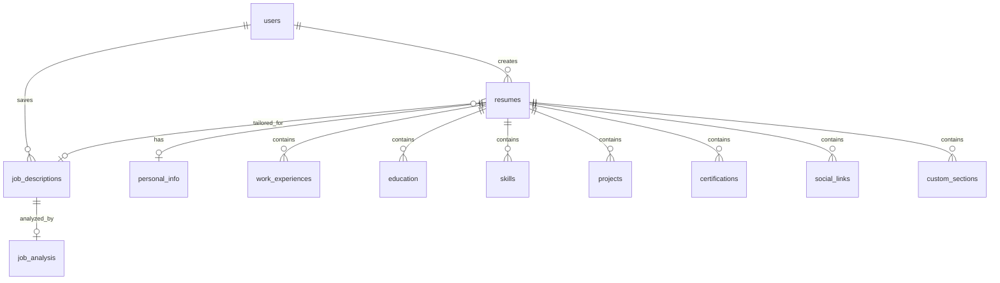

# Victry: AI-Powered Resume Builder - Comprehensive Technical Documentation

## Table of Contents
- [Overview](#overview)
- [Technology Stack](#technology-stack)
- [Application Architecture](#application-architecture)
- [Database Schema](#database-schema)
- [AI Integration](#ai-integration)
- [Authentication & Authorization](#authentication--authorization)
- [API Architecture](#api-architecture)
- [Frontend Components](#frontend-components)
- [User Flows](#user-flows)
- [Features & Functionality](#features--functionality)
- [Testing Strategy](#testing-strategy)
- [Security & Performance](#security--performance)
- [Development Guidelines](#development-guidelines)

## Overview

Victry is a sophisticated AI-powered resume builder that helps professionals create, tailor, and optimize resumes for job applications. The application leverages Claude AI to analyze job descriptions and intelligently tailor resumes while maintaining authenticity and ensuring ATS (Applicant Tracking System) compatibility.

### Core Value Proposition
- **AI-Powered Tailoring**: Uses Claude AI to automatically adapt resumes to specific job descriptions
- **ATS Optimization**: Ensures resumes pass through automated screening systems
- **Professional Templates**: Offers multiple resume templates with customization options
- **Job Matching Analysis**: Provides detailed analysis of how well resumes match job requirements
- **Export Capabilities**: Supports PDF export with professional formatting

## Technology Stack

### Frontend Technologies
- **Framework**: Next.js 15.3.2 with React 19.1.0
- **Styling**: Tailwind CSS v4.1.7 (currently migrating from v3)
- **UI Components**: Radix UI primitives with custom shadcn-style components
- **Rich Text Editing**: TipTap editor with extensions
- **Animation**: Framer Motion 12.12.1
- **State Management**: React hooks with custom service layer
- **Form Handling**: React Hook Form with Zod validation
- **Date Management**: date-fns 4.1.0
- **Icons**: Lucide React 0.511.0
- **Drag & Drop**: @dnd-kit for sortable components

### Backend Technologies
- **Framework**: Next.js API routes
- **Database**: Supabase (PostgreSQL) with Row Level Security (RLS)
- **Authentication**: Supabase Auth with JWT tokens
- **AI Integration**: Anthropic Claude API (SDK v0.51.0)
- **File Storage**: Supabase Storage for templates and exports
- **Real-time**: Supabase Realtime (when needed)

### Development & Testing
- **TypeScript**: v5.8.2 with strict mode
- **Testing**: Jest 29.7.0 with Testing Library
- **Linting**: ESLint with Next.js config
- **Code Quality**: Prettier for formatting
- **Build Tool**: Next.js built-in bundler
- **Package Manager**: npm with package-lock.json

### Infrastructure
- **Deployment**: Vercel (implied from next.config.ts)
- **Environment**: Node.js with modern ES features
- **Security**: Content Security Policy headers
- **Monitoring**: Built-in audit logging and query monitoring

## Application Architecture

### High-Level Architecture

```
┌─────────────────┐    ┌─────────────────┐    ┌─────────────────┐
│   Frontend      │    │   API Routes    │    │   External      │
│   (Next.js)     │◄──►│   (Next.js)     │◄──►│   Services      │
│                 │    │                 │    │                 │
│ • React 19      │    │ • Auth Routes   │    │ • Claude AI     │
│ • Tailwind v4   │    │ • AI Routes     │    │ • Supabase      │
│ • Radix UI      │    │ • CRUD Routes   │    │                 │
└─────────────────┘    └─────────────────┘    └─────────────────┘
         │                       │                       │
         └───────────────────────┼───────────────────────┘
                                 │
                    ┌─────────────────┐
                    │   Service       │
                    │   Layer         │
                    │                 │
                    │ • AI Service    │
                    │ • Resume Svc    │
                    │ • Job Desc Svc  │
                    └─────────────────┘
```

### Layered Architecture Pattern

1. **Presentation Layer**: React components, pages, and UI logic
2. **API Layer**: Next.js API routes handling HTTP requests
3. **Service Layer**: Business logic abstraction (ai-service, resume-service, etc.)
4. **Data Layer**: Supabase client for database operations
5. **External Services**: Claude AI API integration

### Directory Structure

```
app/
├── (auth)/                 # Auth route group
├── api/                    # API route handlers
│   ├── ai/                 # AI-related endpoints
│   ├── audit-logs/         # Audit logging
│   └── db-monitoring/      # Database monitoring
├── dashboard/              # Dashboard pages
├── resume/                 # Resume management
│   ├── [id]/              # Dynamic resume routes
│   │   ├── edit/          # Resume editing
│   │   └── tailor/        # AI tailoring
│   └── _components/       # Resume-specific components
└── globals.css            # Global styles

components/
├── auth/                   # Authentication components
├── ai/                     # AI-related components
├── layout/                 # Layout components
├── resume/                 # Resume components
└── ui/                     # Base UI components (Radix-based)

lib/
├── ai/                     # AI integration utilities
├── services/               # Business logic services
├── supabase/              # Supabase utilities
├── utils/                 # General utilities
└── middlewares/           # Custom middleware

types/
├── api.ts                 # API type definitions
├── resume.ts              # Resume type definitions
└── user.ts                # User type definitions
```

## Database Schema

### Core Entity Relationships



### Primary Tables

#### users (Supabase Auth)
- Managed by Supabase Auth system
- Extended with roles in `app_metadata`
- Supports OAuth providers (Google, GitHub, etc.)

#### resumes
```sql
CREATE TABLE resumes (
  id UUID PRIMARY KEY DEFAULT gen_random_uuid(),
  user_id UUID NOT NULL REFERENCES auth.users(id),
  title TEXT NOT NULL,
  target_job_title TEXT,
  template_id TEXT NOT NULL,
  created_at TIMESTAMPTZ DEFAULT now(),
  updated_at TIMESTAMPTZ DEFAULT now(),
  is_base_resume BOOLEAN DEFAULT true,
  original_resume_id UUID REFERENCES resumes(id),
  job_description_id UUID,
  ats_score NUMERIC,
  metadata JSONB,
  format_options JSONB
);
```

#### Resume Component Tables
- **personal_info**: Contact information and basic details
- **work_experiences**: Job history with highlights array
- **education**: Educational background
- **skills**: Skills with categories and proficiency levels
- **projects**: Portfolio projects with technologies
- **certifications**: Professional certifications
- **social_links**: Professional social media links
- **custom_sections**: User-defined resume sections

#### job_descriptions
```sql
CREATE TABLE job_descriptions (
  id UUID PRIMARY KEY DEFAULT gen_random_uuid(),
  user_id UUID NOT NULL REFERENCES auth.users(id),
  title TEXT NOT NULL,
  company TEXT NOT NULL,
  location TEXT,
  content TEXT NOT NULL,
  url TEXT,
  application_deadline TIMESTAMPTZ,
  application_status application_status_enum DEFAULT 'not_applied',
  has_applied BOOLEAN DEFAULT false,
  is_favorite BOOLEAN DEFAULT false,
  tags TEXT[],
  salary_range JSONB,
  industry TEXT,
  department TEXT
);
```

#### job_analysis
```sql
CREATE TABLE job_analysis (
  id UUID PRIMARY KEY DEFAULT gen_random_uuid(),
  job_description_id UUID NOT NULL REFERENCES job_descriptions(id),
  requirements JSONB[] NOT NULL,
  keywords JSONB[] NOT NULL,
  experience_level TEXT NOT NULL,
  company_culture TEXT[] NOT NULL,
  ats_compatibility_score NUMERIC,
  responsibilities TEXT[],
  salary_range JSONB
);
```

### Data Types & Enums

```sql
CREATE TYPE application_status_enum AS ENUM (
  'not_applied',
  'applied', 
  'interview_scheduled',
  'interview_completed',
  'offer_received',
  'accepted',
  'rejected',
  'withdrawn'
);

CREATE TYPE skill_level_enum AS ENUM (
  'beginner',
  'intermediate', 
  'advanced',
  'expert'
);
```

### Row Level Security (RLS)

All tables implement RLS policies ensuring users can only access their own data:

```sql
-- Example RLS policy
CREATE POLICY "Users can only see their own resumes" 
ON resumes FOR SELECT 
USING (user_id = auth.uid());

CREATE POLICY "Users can only update their own resumes"
ON resumes FOR UPDATE
USING (user_id = auth.uid());
```

## AI Integration

### Architecture Overview

The AI integration follows a layered architecture pattern with multiple fallback mechanisms for robust operation:

```
Frontend → API Routes → Service Layer → Claude Client → Anthropic API
```

### Claude API Integration

#### Client Architecture
- **Primary Client**: `claude-client.ts` with structured tool calling
- **Fallback Support**: Multiple response parsing strategies
- **Error Handling**: Comprehensive error handling with retry logic
- **Rate Limiting**: Exponential backoff for rate limit handling

#### Structured Data Extraction
```typescript
function extractStructuredData<T>(response: Anthropic.Message, toolName?: string): T {
  // 1. Check for tool_use content blocks
  if (Array.isArray(response.content) && toolName) {
    for (const block of response.content) {
      if (block.type === 'tool_use' && block.name === toolName) {
        return block.input as T;
      }
    }
  }
  
  // 2. Fall back to JSON in code blocks
  const jsonMatch = fullText.match(/```(?:json)?\n([\s\S]*?)\n```/);
  
  // 3. Try plain JSON extraction
  // 4. Multiple additional fallback approaches...
}
```

### AI Services

#### Job Analysis Service
- **Input**: Raw job description text
- **Process**: Extracts requirements, keywords, experience level, company culture
- **Output**: Structured `JobAnalysis` object
- **Tools**: Uses `job_analysis` tool with JSON schema validation

#### Resume Tailoring Service  
- **Input**: Resume + Job Description + Tailoring Settings
- **Process**: AI-powered content optimization while preserving voice
- **Output**: Tailored resume + ATS score + keyword matches
- **Tools**: Uses `resume_tailoring` tool with comprehensive schema

#### ATS Scoring Service
- **Input**: Resume text + Job description
- **Process**: Analyzes ATS compatibility factors
- **Output**: Score (0-100) + detailed feedback
- **Factors**: Keywords, format, section structure, qualification matching

#### Additional AI Services
- **Bullet Point Enhancement**: Individual content improvement
- **Professional Summary Generation**: Multiple summary options
- **Job Matching Analysis**: Comprehensive resume-job fit analysis
- **Keyword Extraction**: Important keywords from job descriptions

### Prompt Engineering

#### Prompt Templates
Centralized in `/lib/ai/prompt-templates.ts`:
- `JOB_ANALYSIS`: Extracts structured job information
- `RESUME_TAILORING`: Optimizes resume content
- `ATS_SCORE`: Analyzes ATS compatibility
- `BULLET_POINT_ENHANCEMENT`: Improves individual bullets
- `PROFESSIONAL_SUMMARY`: Generates summary options

#### Tool Definitions
Structured tool schemas for consistent AI responses:
```typescript
const jobAnalysisTool = createTool(
  "job_analysis",
  "Tool for structured job description analysis",
  {
    type: "object",
    properties: {
      hardSkills: { type: "array", items: { /* ... */ } },
      softSkills: { type: "array", items: { /* ... */ } },
      qualifications: { /* ... */ },
      keywords: { /* ... */ }
    }
  }
);
```

## Authentication & Authorization

### Authentication System
- **Provider**: Supabase Auth
- **Methods**: Email/password, OAuth (Google, GitHub, etc.)
- **Session Management**: JWT tokens with automatic refresh
- **Security**: HTTP-only cookies for token storage

### Role-Based Access Control (RBAC)

#### User Roles
1. **Basic (Free)**: Limited features, 3 resumes max
2. **Premium**: Full features, unlimited resumes  
3. **Admin**: All features + system administration

#### Role Storage
Roles stored in JWT `app_metadata.roles` array:
```typescript
interface JWTClaims {
  app_metadata: {
    roles: ('admin' | 'premium' | 'basic')[];
  }
}
```

#### Middleware Protection
```typescript
// middleware.ts
const ROUTE_PROTECTION = {
  adminRoutes: ['/dashboard/admin', '/api/admin'],
  premiumRoutes: ['/api/ai/tailor-resume', '/resume/*/tailor']
};
```

#### Permission Utilities
```typescript
// Server-side
export async function hasRole(role: UserRole): Promise<boolean>
export async function isPremium(): Promise<boolean>
export async function canUseAiFeature(feature: string): Promise<boolean>

// Client-side
export function useHasRole(role: UserRole): Promise<boolean>
export function useIsPremium(): Promise<boolean>
```

### Feature Gating

#### Subscription Limits
```typescript
const limits = {
  free: {
    maxResumes: 3,
    maxTailoredResumes: 1,
    maxAtsChecks: 3,
    maxAiTailoringOps: 5
  },
  premium: {
    maxResumes: 10,
    maxTailoredResumes: 20,
    maxAtsChecks: 50,
    maxAiTailoringOps: 100
  }
};
```

#### Usage Tracking
- Real-time usage monitoring in user metadata
- Monthly reset of usage counters
- Automatic limit enforcement at API level

## API Architecture

### API Design Principles
- **RESTful Routes**: Standard HTTP methods and status codes
- **Type Safety**: Full TypeScript coverage for requests/responses
- **Error Handling**: Standardized error response format
- **Validation**: Zod schemas for input validation
- **Pagination**: Consistent pagination for list endpoints

### API Route Structure

#### Resume Management
```typescript
// CRUD Operations
GET    /api/resume           # List user resumes
POST   /api/resume           # Create new resume
GET    /api/resume/[id]      # Get specific resume
PUT    /api/resume/[id]      # Update resume
DELETE /api/resume/[id]      # Delete resume
POST   /api/resume/[id]/duplicate  # Duplicate resume
```

#### AI Services
```typescript
// AI-Powered Operations
POST /api/ai/analyze-job     # Analyze job description
POST /api/ai/tailor-resume   # Tailor resume to job
POST /api/ai/claude          # General Claude queries
POST /api/ai/claude-stream   # Streaming responses
```

#### Job Descriptions
```typescript
// Job Description Management
GET    /api/job-description           # List job descriptions
POST   /api/job-description           # Save job description
GET    /api/job-description/[id]      # Get specific job description
PUT    /api/job-description/[id]      # Update job description
DELETE /api/job-description/[id]      # Delete job description
```

#### Monitoring & Admin
```typescript
// Admin-only endpoints
GET /api/audit-logs          # Security audit trail
GET /api/db-monitoring       # Database performance
GET /api/query-analyzer      # Query analysis
```

### Request/Response Types

#### Comprehensive Type System
All API operations have corresponding TypeScript types:
```typescript
// Request types
export type CreateResumeRequest = Omit<Resume, "id" | "userId" | "createdAt" | "updatedAt">;
export type UpdateResumeRequest = Partial<Omit<Resume, "id" | "userId" | "createdAt" | "updatedAt">>;

// Response types  
export interface ResumesResponse {
  data: Resume[];
  count: number;
  pagination?: PaginationMetadata;
}

// AI operation types
export interface TailorResumeRequest {
  resumeId: string;
  jobDescriptionId: string;
  settings: TailoringSettings;
}

export interface TailorResumeResponse {
  tailoredResume: Resume;
  atsScore: ATSScoreResult;
  keywordMatches: KeywordMatch[];
}
```

### Error Handling

#### Standardized Error Format
```typescript
export interface ApiErrorResponse {
  error: string;
  code?: string;
  validationErrors?: Array<{
    field: string;
    message: string;
  }>;
  requestId?: string;
}
```

#### Error Categories
```typescript
enum ErrorCategory {
  AUTH = "auth",           // 401 - Authentication
  PERMISSION = "permission", // 403 - Authorization  
  VALIDATION = "validation", // 400 - Input errors
  NOT_FOUND = "not_found",  // 404 - Missing resource
  CONFLICT = "conflict",    // 409 - Duplicate/conflict
  AI = "ai",               // 500 - AI service errors
  DATABASE = "database",    // 500 - Database errors
  SERVER = "server"        // 500 - General server errors
}
```

## Frontend Components

### Component Architecture

#### Design System
- **Base Components**: Radix UI primitives with Tailwind styling
- **Composite Components**: Business logic components
- **Page Components**: Full page layouts
- **Layout Components**: Header, footer, navigation

#### Component Categories

1. **UI Components** (`/components/ui/`)
   - Button, Input, Dialog, Tabs, etc.
   - Built on Radix UI primitives
   - Consistent styling with Tailwind CSS
   - Full accessibility support

2. **Business Components** (`/components/`)
   - Resume editing components
   - AI interaction components  
   - Authentication components
   - Layout components

3. **Page Components** (`/app/`)
   - Full page layouts
   - Route-specific logic
   - Data fetching and state management

### Key Component Patterns

#### Resume Editor Architecture
```typescript
// Three-panel layout
<div className="flex h-screen">
  {/* Left: Section Editor */}
  <div className="w-[300px]">
    <ResumeEditor id={id} />
  </div>
  
  {/* Center: Live Preview */}  
  <div className="flex-grow">
    <ResumePreview id={id} />
  </div>
  
  {/* Right: Tools Panel */}
  <div className="w-[350px]">
    <Tabs>
      <TabsContent value="templates">
        <TemplatesPanel />
      </TabsContent>
      <TabsContent value="score">
        <ResumeScorePanel />
      </TabsContent>
      <TabsContent value="jobMatch">
        <JobMatchPanel />
      </TabsContent>
    </Tabs>
  </div>
</div>
```

#### State Management Pattern
```typescript
// Custom hooks for data management
const { resume, loading, error, updateResume } = useResume(id);
const { jobDescriptions } = useJobDescriptions();

// Service layer integration
const handleSave = async () => {
  try {
    await updateResume(resume);
    // Success handling
  } catch (error) {
    // Error handling
  }
};
```

### Styling & Theming

#### Tailwind CSS v4 Migration
- Currently migrating from Tailwind v3 to v4
- Many components have `.new` versions for v4
- Backup files preserved during migration

#### Theme System
```typescript
// Theme provider with system preference
<ThemeProvider
  attribute="class"
  defaultTheme="system"
  enableSystem
  disableTransitionOnChange
>
  {children}
</ThemeProvider>
```

#### Responsive Design
- Mobile-first approach
- Consistent breakpoints
- Touch-friendly interfaces

## User Flows

### Primary User Journeys

#### 1. New User Onboarding
```
Register → Email Verification → Dashboard → Create First Resume → Template Selection → Resume Building
```

#### 2. Resume Creation Flow
```
Dashboard → Create Resume → Template Selection → Personal Info → Work Experience → Education → Skills → Preview → Save
```

#### 3. AI Resume Tailoring Flow
```
Select Resume → Tailor Option → Job Description Input → Tailoring Settings → AI Processing → Review Results → Save/Export
```

#### 4. Job Application Workflow
```
Save Job Description → Analyze Job → Tailor Resume → ATS Score Review → Export PDF → Track Application
```

### Detailed Flow Analysis

#### Resume Editing Experience
1. **Navigation**: Three-panel interface (editor/preview/tools)
2. **Real-time Updates**: Live preview as user edits
3. **Template Switching**: Instant template changes with preview
4. **Section Management**: Add/remove/reorder resume sections
5. **Autosave**: Automatic saving of changes
6. **Export Options**: PDF download with formatting options

#### AI Tailoring Experience  
1. **Job Input**: Paste job description or select saved job
2. **Analysis**: AI extracts job requirements and keywords
3. **Settings**: Configure tailoring intensity and preferences
4. **Processing**: AI optimizes resume content
5. **Review**: Three-tab analysis (preview/ATS score/keywords)
6. **Actions**: Save as new resume or export PDF

#### Dashboard Experience
1. **Overview**: Statistics on resumes, jobs, and activity
2. **Quick Actions**: One-click access to common tasks
3. **Recent Items**: Latest resumes and job descriptions
4. **Role-based Features**: Admin controls and premium features conditionally displayed

## Features & Functionality

### Core Features

#### Resume Management
- **Template System**: Multiple professional templates
- **Modular Sections**: Personal info, work experience, education, skills, projects, certifications
- **Custom Sections**: User-defined additional sections
- **Version Control**: Track resume versions and changes
- **Duplicate & Fork**: Create variations of existing resumes

#### AI-Powered Features
- **Job Analysis**: Extract requirements, keywords, and insights
- **Resume Tailoring**: Intelligent content optimization
- **ATS Scoring**: Compatibility analysis with feedback
- **Keyword Matching**: Identify missing/present keywords
- **Bullet Enhancement**: Improve individual bullet points
- **Summary Generation**: Create professional summaries

#### Job Management
- **Job Saving**: Store job descriptions for future reference
- **Application Tracking**: Track application status and dates
- **Job Analysis**: AI-powered job requirement extraction
- **Favorite Jobs**: Mark important job opportunities

#### Export & Sharing
- **PDF Export**: Professional PDF generation
- **Multiple Formats**: Support for various export formats
- **Custom Formatting**: Adjustable margins, fonts, and layout
- **Download Management**: Secure file delivery

### Advanced Features

#### Premium Features
- **Unlimited Resumes**: No limit on resume creation
- **Advanced AI**: Enhanced tailoring and analysis
- **Premium Templates**: Access to professional designs
- **Cover Letter Generation**: AI-powered cover letters
- **Application Tracking**: Comprehensive job application management

#### Admin Features
- **User Management**: Admin dashboard for user control
- **Analytics**: System usage and performance metrics
- **Template Management**: Create and manage resume templates
- **System Monitoring**: Database and query performance tracking

### Feature Gating System

#### Subscription Tiers
```typescript
const featureAccess = {
  free: {
    maxResumes: 3,
    maxTailoredResumes: 1,
    basicTemplates: true,
    atsCheck: 3,
    aiOperations: 5
  },
  premium: {
    maxResumes: 10,
    maxTailoredResumes: 20,
    premiumTemplates: true,
    unlimitedAts: true,
    unlimitedAi: true,
    coverLetters: true
  },
  admin: {
    unlimited: true,
    systemAccess: true,
    userManagement: true
  }
};
```

## Testing Strategy

### Testing Architecture

#### Testing Stack
- **Framework**: Jest 29.7.0
- **React Testing**: Testing Library
- **Environment**: jsdom for browser simulation
- **Mocking**: MSW (Mock Service Worker) for API mocking
- **Database**: Automatic reset between tests

#### Test Categories

1. **Unit Tests** (`/tests/unit/`)
   - Individual component testing
   - Utility function testing
   - Service layer testing

2. **Integration Tests** (`/tests/integration/`)
   - API route testing
   - Database integration testing
   - Authentication flow testing

3. **AI Service Tests** (`/__tests__/lib/ai/`)
   - Claude client testing
   - AI service functionality
   - Error handling validation

#### Test Configuration
```javascript
// jest.config.js
module.exports = {
  preset: 'next/jest',
  testEnvironment: 'jsdom',
  setupFilesAfterEnv: ['<rootDir>/jest.setup.js'],
  coverageThreshold: {
    global: {
      branches: 70,
      functions: 70,
      lines: 70,
      statements: 70
    }
  }
};
```

#### Database Testing
- **Auto-reset**: Database automatically reset before each test
- **Test Data**: Consistent test data generation
- **Isolation**: Each test runs with clean database state

#### Test Utilities
```typescript
// tests/utils/test-utils.ts
export function resetTestDatabase(): Promise<void>
export function createTestUser(): Promise<User>
export function createTestResume(userId: string): Promise<Resume>
export function mockSupabaseAuth(): void
```

## Security & Performance

### Security Measures

#### Authentication Security
- **JWT Tokens**: Secure token-based authentication
- **HTTP-Only Cookies**: Prevent XSS attacks
- **Session Management**: Automatic token refresh
- **CSRF Protection**: Built-in CSRF protection

#### Authorization Security
- **Row Level Security**: Database-level access control
- **Role-based Access**: Middleware-enforced permissions
- **API Route Protection**: Authentication required for sensitive operations
- **Input Validation**: Zod schemas for all inputs

#### Data Security
- **Encryption**: Sensitive data encrypted at rest
- **Audit Logging**: Comprehensive audit trail
- **Environment Variables**: Secrets managed securely
- **CORS Configuration**: Proper cross-origin settings

#### Security Headers
```typescript
// next.config.ts security headers
const securityHeaders = [
  'X-DNS-Prefetch-Control: on',
  'Strict-Transport-Security: max-age=63072000',
  'X-XSS-Protection: 1; mode=block',
  'X-Frame-Options: SAMEORIGIN',
  'X-Content-Type-Options: nosniff',
  'Referrer-Policy: origin-when-cross-origin'
];
```

### Performance Optimization

#### Frontend Performance
- **Code Splitting**: Automatic route-based splitting
- **Image Optimization**: Next.js image optimization
- **Lazy Loading**: Suspense-based component loading
- **Bundle Analysis**: Webpack bundle analyzer integration

#### Backend Performance
- **Database Optimization**: Indexed queries and materialized views
- **Caching**: Strategic caching of AI responses
- **Connection Pooling**: Supabase connection optimization
- **Query Monitoring**: Real-time query performance tracking

#### AI Performance
- **Response Caching**: Cache AI responses when appropriate
- **Retry Logic**: Exponential backoff for rate limits
- **Timeout Management**: Proper timeout handling
- **Error Recovery**: Graceful degradation

## Development Guidelines

### Code Organization

#### File Naming Conventions
- **Components**: PascalCase (e.g., `ResumeEditor.tsx`)
- **Utilities**: kebab-case (e.g., `auth-utils.ts`)
- **API Routes**: kebab-case (e.g., `tailor-resume/route.ts`)
- **Types**: kebab-case (e.g., `job-description.ts`)

#### Import Organization
```typescript
// External libraries
import { useState, useEffect } from 'react';
import { NextRequest, NextResponse } from 'next/server';

// Internal utilities
import { createClient } from '@/lib/supabase/client';
import { generateCompletion } from '@/lib/ai/claude-client';

// Components
import { Button } from '@/components/ui/button';
import { ResumeEditor } from '@/components/resume/resume-editor';

// Types
import type { Resume } from '@/types/resume';
```

#### Component Structure
```typescript
// Component file structure
interface ComponentProps {
  // Props definition
}

export function Component({ ...props }: ComponentProps) {
  // Hooks
  // State
  // Effects
  // Event handlers
  // Render logic
}
```

### Development Workflow

#### Git Workflow
- **Main Branch**: Production-ready code
- **Feature Branches**: Individual feature development
- **Pull Requests**: Code review required
- **Commit Messages**: Conventional commit format

#### Code Quality
- **TypeScript**: Strict mode enabled
- **ESLint**: Code quality enforcement
- **Prettier**: Consistent code formatting
- **Type Coverage**: No `any` types allowed

#### Testing Requirements
- **Coverage**: Minimum 70% coverage required
- **Unit Tests**: Required for all utilities and services
- **Integration Tests**: Required for API routes
- **E2E Tests**: For critical user flows

### Environment Configuration

#### Environment Variables
```bash
# Required environment variables
NEXT_PUBLIC_SUPABASE_URL=           # Supabase project URL
NEXT_PUBLIC_SUPABASE_ANON_KEY=      # Supabase anonymous key
SUPABASE_SERVICE_ROLE_KEY=          # Supabase service role key
ANTHROPIC_API_KEY=                  # Claude API key
NEXT_PUBLIC_APP_URL=                # Application URL
```

#### Development Commands
```bash
# Development
npm run dev                 # Start development server
npm run build              # Build for production
npm run start              # Start production server

# Code Quality
npm run lint               # Run ESLint
npx tsc --noEmit          # Type check
npm run format            # Format code with Prettier

# Testing
npm run test              # Run all tests
npm run test:unit         # Run unit tests only
npm run test:integration  # Run integration tests only
npm run test:watch        # Watch mode testing
npm run test:coverage     # Generate coverage report
```

### Best Practices

#### Component Development
- **Single Responsibility**: Each component has one clear purpose
- **Composition over Inheritance**: Use composition patterns
- **Error Boundaries**: Implement error handling
- **Accessibility**: Follow WCAG guidelines
- **Performance**: Use React.memo and useMemo appropriately

#### API Development
- **Input Validation**: Validate all inputs with Zod
- **Error Handling**: Use standardized error responses
- **Authentication**: Check authentication on all protected routes
- **Rate Limiting**: Implement appropriate rate limits
- **Documentation**: Document all API endpoints

#### Database Development
- **Migrations**: Use versioned database migrations
- **RLS Policies**: Implement Row Level Security
- **Indexing**: Add appropriate database indexes
- **Data Validation**: Use database constraints
- **Backup Strategy**: Regular automated backups

---

*This documentation provides a comprehensive overview of the Victry application architecture, technologies, and implementation details. It serves as a reference for understanding the system's design decisions, data flows, and development practices.*