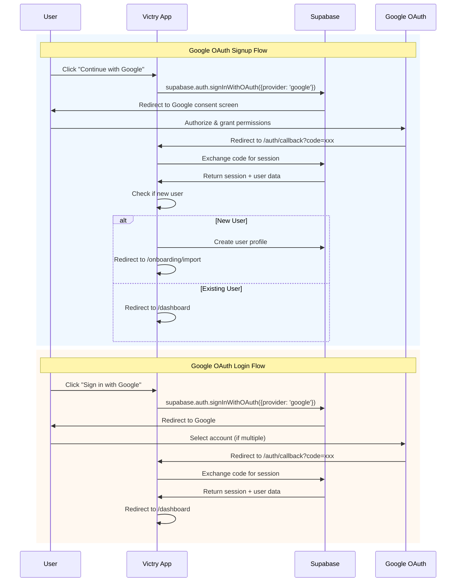
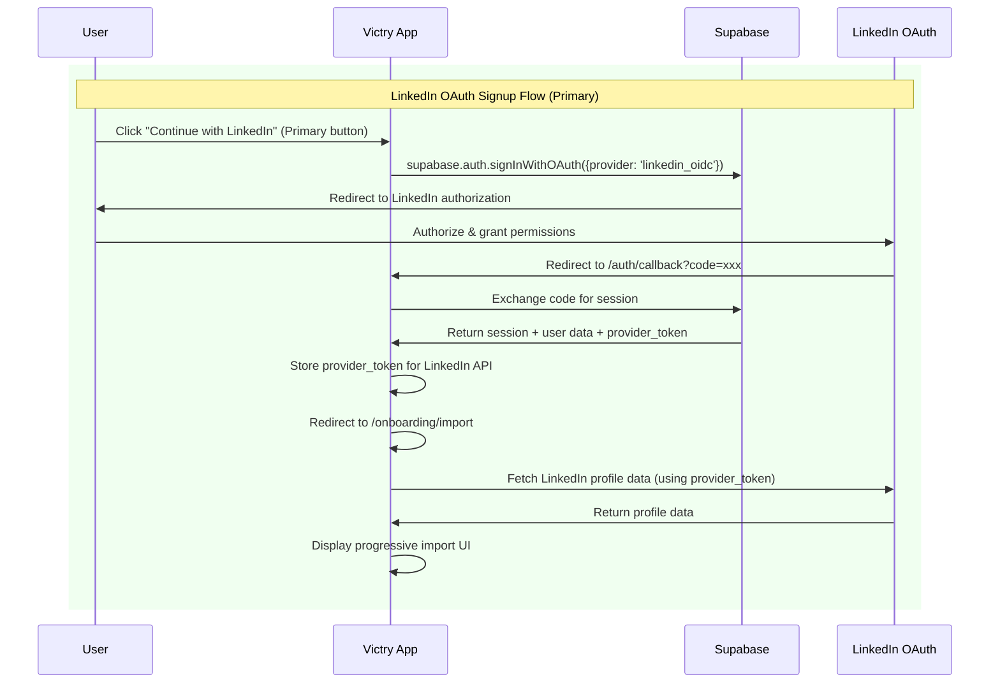
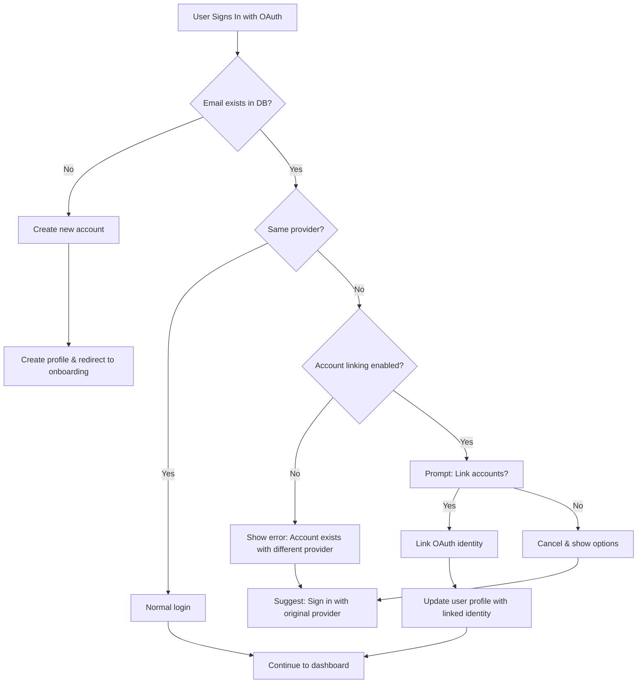
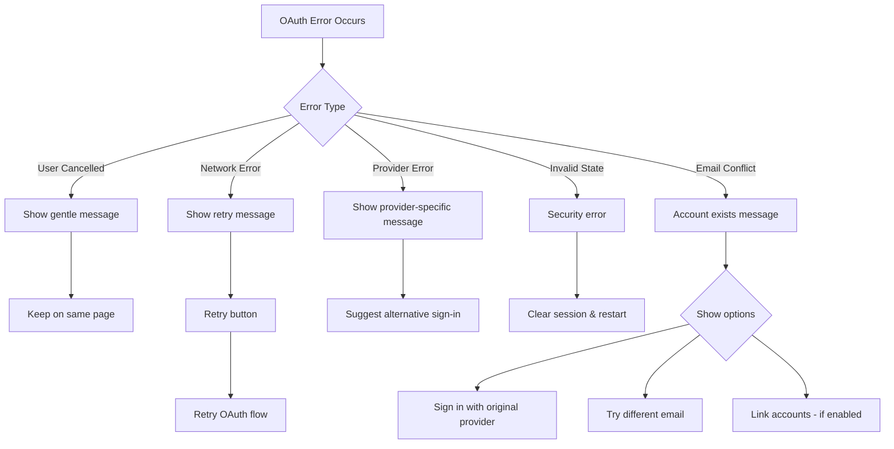

# Victry OAuth Implementation Plan

## Table of Contents
1. [OAuth Setup Summary](#oauth-setup-summary)
2. [Provider Configuration Guide](#provider-configuration-guide)
3. [UI Component Specifications](#ui-component-specifications)
4. [OAuth Flow Diagrams](#oauth-flow-diagrams)
5. [Phase-by-Phase OAuth Implementation](#phase-by-phase-oauth-implementation)
6. [Testing Checklist](#testing-checklist)

## OAuth Setup Summary

### Current State Analysis

#### Google OAuth Status
- ✅ **UI Elements**: Google OAuth button exists in both login and register forms
- ✅ **Basic Flow**: OAuth flow initiated with `supabase.auth.signInWithOAuth()`
- ✅ **Button Design**: Native Google button with proper SVG icon
- ❌ **Backend Config**: Not configured in Supabase dashboard
- ❌ **Callback Route**: Missing `/auth/callback` route handler
- ❌ **Session Handling**: No post-OAuth session management
- ❌ **Profile Creation**: No automatic user profile creation

#### LinkedIn OAuth Status
- ❌ **UI Elements**: No LinkedIn OAuth button implemented
- ❌ **Backend Config**: Not configured in Supabase
- ❌ **Integration**: No LinkedIn-specific data import logic
- ❌ **Button Design**: No native LinkedIn button component

#### Critical Missing Pieces
1. **OAuth Callback Handler**: No route to exchange auth codes for sessions
2. **Provider Configuration**: Neither provider configured in Supabase
3. **Account Linking**: No handling for same email, different providers
4. **Error Recovery**: No OAuth-specific error handling
5. **Token Management**: No provider token storage for API access

### Native Button Implementation Approach

Both OAuth providers require adherence to their brand guidelines:

#### Google Sign-In Button Requirements
- **Minimum Size**: 40px height
- **Color Schemes**: Light (white background) or Dark (blue background)
- **Text Options**: "Sign in with Google" or "Continue with Google"
- **Icon**: Official Google "G" logo required
- **Spacing**: Specific padding requirements around icon and text

#### LinkedIn Sign-In Button Requirements
- **Color**: LinkedIn blue (#0077B5) or white background
- **Text**: "Sign in with LinkedIn" or "Continue with LinkedIn"
- **Icon**: LinkedIn "in" logo required
- **Height**: Minimum 40px for accessibility

## Provider Configuration Guide

### Google OAuth Configuration

#### 1. Google Cloud Console Setup
```bash
# Prerequisites
1. Access Google Cloud Console: https://console.cloud.google.com
2. Create or select a project
3. Enable Google+ API

# OAuth 2.0 Credentials
1. Navigate to APIs & Services > Credentials
2. Create OAuth 2.0 Client ID
3. Application Type: Web application
4. Authorized JavaScript origins:
   - http://localhost:3000 (development)
   - https://your-app-domain.com (production)
   
5. Authorized redirect URIs:
   - https://gdkhyvxlkhqtdslpgiws.supabase.co/auth/v1/callback
   - http://localhost:3000/auth/callback
```

#### 2. Supabase Dashboard Configuration
```bash
# Since Supabase MCP doesn't support auth provider configuration,
# these steps must be done manually in the dashboard:

1. Navigate to Authentication > Providers
2. Enable Google provider
3. Enter Google OAuth credentials:
   - Client ID: [from Google Cloud Console]
   - Client Secret: [from Google Cloud Console]
4. Save configuration
```

#### 3. Environment Variables
```env
# .env.local
NEXT_PUBLIC_SUPABASE_URL=https://gdkhyvxlkhqtdslpgiws.supabase.co
NEXT_PUBLIC_SUPABASE_ANON_KEY=[your-anon-key]
NEXT_PUBLIC_APP_URL=http://localhost:3000

# Not needed in env - configured in Supabase dashboard
# GOOGLE_CLIENT_ID=[your-client-id]
# GOOGLE_CLIENT_SECRET=[your-client-secret]
```

### LinkedIn OAuth Configuration

#### 1. LinkedIn Developer App Setup
```bash
# Prerequisites
1. Access LinkedIn Developer Portal: https://www.linkedin.com/developers/
2. Create a new app or select existing

# OAuth 2.0 Settings
1. Navigate to Auth tab
2. Add OAuth 2.0 redirect URLs:
   - https://gdkhyvxlkhqtdslpgiws.supabase.co/auth/v1/callback
   - http://localhost:3000/auth/callback
   
3. OAuth 2.0 scopes required:
   - openid (required for OIDC)
   - profile (basic profile information)
   - email (email address)
   - w_member_social (optional - for posting)
```

#### 2. Supabase Dashboard Configuration
```bash
# Manual configuration required:
1. Navigate to Authentication > Providers
2. Enable LinkedIn (OIDC) provider
3. Enter LinkedIn OAuth credentials:
   - Client ID: [from LinkedIn Developer Portal]
   - Client Secret: [from LinkedIn Developer Portal]
4. Save configuration
```

### Redirect URL Configuration

Both providers require the following redirect URLs:

#### Development
- `http://localhost:3000/auth/callback`

#### Production
- `https://your-domain.com/auth/callback`
- `https://gdkhyvxlkhqtdslpgiws.supabase.co/auth/v1/callback`

## UI Component Specifications

### Native Google Sign-In Button Component

```typescript
// components/auth/google-oauth-button.tsx
import { Button } from "@/components/ui/button";
import { Loader2 } from "lucide-react";

interface GoogleOAuthButtonProps {
  loading?: boolean;
  onClick: () => void | Promise<void>;
  variant?: "signin" | "signup";
  fullWidth?: boolean;
  disabled?: boolean;
}

export function GoogleOAuthButton({ 
  loading = false,
  onClick,
  variant = "signin",
  fullWidth = true,
  disabled = false
}: GoogleOAuthButtonProps) {
  const text = variant === "signin" 
    ? "Sign in with Google" 
    : "Continue with Google";

  return (
    <Button
      type="button"
      variant="outline"
      className={`
        flex items-center justify-center gap-3
        min-h-[44px] px-4 py-2.5
        bg-white hover:bg-gray-50
        border border-gray-300 hover:border-gray-400
        text-gray-700 font-medium
        transition-all duration-200
        ${fullWidth ? 'w-full' : ''}
        ${disabled || loading ? 'opacity-60 cursor-not-allowed' : ''}
      `}
      onClick={onClick}
      disabled={disabled || loading}
      aria-label={text}
    >
      {loading ? (
        <Loader2 className="h-5 w-5 animate-spin" />
      ) : (
        <svg
          className="h-5 w-5"
          viewBox="0 0 24 24"
          xmlns="http://www.w3.org/2000/svg"
          aria-hidden="true"
        >
          <path
            d="M12.0003 4.75C13.7703 4.75 15.3553 5.36 16.6053 6.54L20.0303 3.11C17.9603 1.19 15.2403 0 12.0003 0C7.31033 0 3.25033 2.69 1.28033 6.60L5.27033 9.71C6.29033 6.89 8.91033 4.75 12.0003 4.75Z"
            fill="#EA4335"
          />
          <path
            d="M23.49 12.27C23.49 11.48 23.42 10.73 23.3 10H12V14.51H18.47C18.18 15.99 17.33 17.24 16.07 18.09L19.93 21.19C22.19 19.09 23.49 15.94 23.49 12.27Z"
            fill="#4285F4"
          />
          <path
            d="M5.26999 14.29C5.02999 13.57 4.89999 12.8 4.89999 12C4.89999 11.2 5.02999 10.43 5.26999 9.71L1.27999 6.6C0.47999 8.24 0.00999451 10.06 0.00999451 12C0.00999451 13.94 0.47999 15.76 1.27999 17.4L5.26999 14.29Z"
            fill="#FBBC05"
          />
          <path
            d="M12.0004 24C15.2404 24 17.9604 22.92 19.9404 21.19L16.0804 18.09C15.0004 18.82 13.6204 19.25 12.0004 19.25C8.91035 19.25 6.29035 17.11 5.27035 14.29L1.28035 17.4C3.25035 21.31 7.31035 24 12.0004 24Z"
            fill="#34A853"
          />
        </svg>
      )}
      <span className={loading ? 'ml-2' : ''}>{text}</span>
    </Button>
  );
}
```

### Native LinkedIn Sign-In Button Component

```typescript
// components/auth/linkedin-oauth-button.tsx
import { Button } from "@/components/ui/button";
import { Loader2 } from "lucide-react";

interface LinkedInOAuthButtonProps {
  loading?: boolean;
  onClick: () => void | Promise<void>;
  variant?: "signin" | "signup";
  fullWidth?: boolean;
  disabled?: boolean;
  priority?: boolean; // For PRD's LinkedIn-first approach
}

export function LinkedInOAuthButton({ 
  loading = false,
  onClick,
  variant = "signin",
  fullWidth = true,
  disabled = false,
  priority = false
}: LinkedInOAuthButtonProps) {
  const text = variant === "signin" 
    ? "Sign in with LinkedIn" 
    : "Continue with LinkedIn";

  return (
    <Button
      type="button"
      variant={priority ? "default" : "outline"}
      className={`
        flex items-center justify-center gap-3
        min-h-[44px] px-4 py-2.5
        ${priority 
          ? 'bg-[#0077B5] hover:bg-[#005885] text-white border-0' 
          : 'bg-white hover:bg-gray-50 text-gray-700 border border-gray-300 hover:border-[#0077B5]'
        }
        font-medium transition-all duration-200
        ${fullWidth ? 'w-full' : ''}
        ${disabled || loading ? 'opacity-60 cursor-not-allowed' : ''}
      `}
      onClick={onClick}
      disabled={disabled || loading}
      aria-label={text}
    >
      {loading ? (
        <Loader2 className="h-5 w-5 animate-spin" />
      ) : (
        <svg
          className="h-5 w-5"
          viewBox="0 0 24 24"
          xmlns="http://www.w3.org/2000/svg"
          aria-hidden="true"
        >
          <path
            d="M20.447 20.452h-3.554v-5.569c0-1.328-.027-3.037-1.852-3.037-1.853 0-2.136 1.445-2.136 2.939v5.667H9.351V9h3.414v1.561h.046c.477-.9 1.637-1.85 3.37-1.85 3.601 0 4.267 2.37 4.267 5.455v6.286zM5.337 7.433c-1.144 0-2.063-.926-2.063-2.065 0-1.138.92-2.063 2.063-2.063 1.14 0 2.064.925 2.064 2.063 0 1.139-.925 2.065-2.064 2.065zm1.782 13.019H3.555V9h3.564v11.452zM22.225 0H1.771C.792 0 0 .774 0 1.729v20.542C0 23.227.792 24 1.771 24h20.451C23.2 24 24 23.227 24 22.271V1.729C24 .774 23.2 0 22.222 0h.003z"
            fill={priority ? "#FFFFFF" : "#0077B5"}
          />
        </svg>
      )}
      <span className={loading ? 'ml-2' : ''}>{text}</span>
    </Button>
  );
}
```

### Button Placement Strategy

```typescript
// For LinkedIn-first signup flow (PRD requirement)
<div className="space-y-3">
  {/* Primary LinkedIn button */}
  <LinkedInOAuthButton 
    onClick={handleLinkedInSignUp}
    variant="signup"
    priority={true}
    loading={loading}
  />
  
  {/* Secondary Google button */}
  <GoogleOAuthButton
    onClick={handleGoogleSignUp}
    variant="signup"
    loading={loading}
  />
  
  {/* Tertiary email option */}
  <Button
    type="button"
    variant="ghost"
    className="w-full text-sm text-gray-600 hover:text-gray-800"
    onClick={() => setShowEmailForm(true)}
  >
    Continue with email instead
  </Button>
</div>
```

### Loading and Error States

```typescript
// components/auth/oauth-error-alert.tsx
interface OAuthErrorAlertProps {
  provider: 'google' | 'linkedin';
  error: string;
  onRetry: () => void;
}

export function OAuthErrorAlert({ provider, error, onRetry }: OAuthErrorAlertProps) {
  const providerName = provider === 'google' ? 'Google' : 'LinkedIn';
  
  const errorMessages: Record<string, string> = {
    'User cancelled flow': `${providerName} sign-in was cancelled. Please try again.`,
    'OAuth error': `Unable to connect to ${providerName}. Please try again later.`,
    'Email already exists': `This email is already registered. Try signing in instead.`,
    'default': `Something went wrong with ${providerName} sign-in. Please try again.`
  };

  const message = errorMessages[error] || errorMessages.default;

  return (
    <div className="rounded-md border border-red-200 bg-red-50 p-4">
      <div className="flex">
        <div className="flex-shrink-0">
          <svg className="h-5 w-5 text-red-400" viewBox="0 0 20 20" fill="currentColor">
            <path fillRule="evenodd" d="M10 18a8 8 0 100-16 8 8 0 000 16zM8.707 7.293a1 1 0 00-1.414 1.414L8.586 10l-1.293 1.293a1 1 0 101.414 1.414L10 11.414l1.293 1.293a1 1 0 001.414-1.414L11.414 10l1.293-1.293a1 1 0 00-1.414-1.414L10 8.586 8.707 7.293z" clipRule="evenodd" />
          </svg>
        </div>
        <div className="ml-3 flex-1">
          <p className="text-sm text-red-700">{message}</p>
        </div>
        <div className="ml-3 flex-shrink-0">
          <button
            type="button"
            onClick={onRetry}
            className="text-sm text-red-600 hover:text-red-500 font-medium"
          >
            Try again
          </button>
        </div>
      </div>
    </div>
  );
}
```

## OAuth Flow Diagrams

### Complete Google OAuth Flow



### Complete LinkedIn OAuth Flow



### Account Linking Flow



### Error Recovery Paths



## Phase-by-Phase OAuth Implementation

### Phase 1: Complete Google OAuth Backend Setup (Immediate - 2 days)

**Objective**: Fix the existing Google OAuth implementation to work end-to-end

**Tasks**:
1. **Create OAuth Callback Route** ✅ Priority
   ```typescript
   // app/auth/callback/route.ts
   import { NextResponse } from 'next/server'
   import { createClient } from '@/utils/supabase/server'
   
   export async function GET(request: Request) {
     const { searchParams, origin } = new URL(request.url)
     const code = searchParams.get('code')
     const next = searchParams.get('next') ?? '/dashboard'
     
     if (code) {
       const supabase = await createClient()
       const { error } = await supabase.auth.exchangeCodeForSession(code)
       
       if (!error) {
         // Check if this is a new user
         const { data: { user } } = await supabase.auth.getUser()
         if (user && !user.user_metadata.profile_created) {
           // First time OAuth user
           return NextResponse.redirect(`${origin}/onboarding/complete-profile`)
         }
         
         return NextResponse.redirect(`${origin}${next}`)
       }
     }
     
     return NextResponse.redirect(`${origin}/auth/error`)
   }
   ```

2. **Configure Google OAuth in Supabase Dashboard**
   - Enable Google provider
   - Add Client ID and Secret
   - Verify redirect URLs

3. **Test Google OAuth Flow**
   - Test signup flow
   - Test login flow
   - Verify session persistence

### Phase 2: Implement Native OAuth Button Components (1 day)

**Objective**: Create reusable, accessible OAuth button components

**Tasks**:
1. **Create GoogleOAuthButton component** ✅
   - Follow Google brand guidelines
   - Implement loading states
   - Add accessibility attributes

2. **Create LinkedInOAuthButton component** ✅
   - Follow LinkedIn brand guidelines
   - Support priority variant for PRD
   - Implement error handling

3. **Update existing auth forms**
   - Replace current buttons with new components
   - Implement proper error handling
   - Add loading states

### Phase 3: Add LinkedIn OAuth Configuration (2 days)

**Objective**: Implement complete LinkedIn OAuth support

**Tasks**:
1. **LinkedIn Developer App Setup**
   - Create/configure LinkedIn app
   - Set OAuth redirect URLs
   - Request necessary scopes

2. **Supabase LinkedIn Configuration**
   - Enable LinkedIn OIDC provider
   - Add Client ID and Secret
   - Test configuration

3. **Implement LinkedIn-specific handlers**
   ```typescript
   // lib/auth/linkedin-handler.ts
   export async function handleLinkedInCallback(session: Session) {
     const { provider_token } = session
     
     if (provider_token) {
       // Store token for LinkedIn API access
       await storeProviderToken(session.user.id, 'linkedin', provider_token)
       
       // Initialize LinkedIn data import
       await initializeLinkedInImport(session.user.id)
     }
   }
   ```

### Phase 4: Integrate with Signup Flow from PRD (3 days)

**Objective**: Implement the LinkedIn-first signup flow as specified in PRD

**Tasks**:
1. **Update Landing Page**
   - Implement LinkedIn as primary CTA
   - Add Google as secondary option
   - Email as tertiary option

2. **Create Import Progress Page**
   ```typescript
   // app/onboarding/import/page.tsx
   export default function ImportProgressPage() {
     // Implement split-screen design
     // Left: Import progress with encouragement
     // Right: Live resume preview
   }
   ```

3. **Implement Progressive Import**
   - LinkedIn profile data fetching
   - Progressive UI updates
   - Error handling for incomplete data

4. **Create Profile Completion Flow**
   - Handle missing LinkedIn data
   - Collect additional required fields
   - Smooth transition to dashboard

### Phase 5: Testing and Error Handling (2 days)

**Objective**: Ensure robust OAuth implementation with comprehensive testing

**Tasks**:
1. **Unit Tests**
   ```typescript
   // __tests__/auth/oauth-buttons.test.tsx
   describe('OAuth Buttons', () => {
     it('renders Google button with correct attributes', () => {})
     it('handles loading state correctly', () => {})
     it('calls onClick handler when clicked', () => {})
   })
   ```

2. **Integration Tests**
   - Test complete OAuth flows
   - Test error scenarios
   - Test account linking

3. **E2E Tests**
   ```typescript
   // __tests__/e2e/oauth-flow.test.ts
   describe('OAuth Signup Flow', () => {
     it('completes Google OAuth signup', () => {})
     it('completes LinkedIn OAuth signup', () => {})
     it('handles OAuth errors gracefully', () => {})
   })
   ```

## Testing Checklist

### Google OAuth Testing

#### Signup Flow
- [ ] User can click "Continue with Google" button
- [ ] Google consent screen appears correctly
- [ ] New user is redirected to profile completion
- [ ] User profile is created in database
- [ ] Session is established correctly
- [ ] Appropriate welcome messaging displayed

#### Login Flow
- [ ] User can click "Sign in with Google" button
- [ ] Existing user is recognized
- [ ] User is redirected to dashboard
- [ ] Session persistence works correctly
- [ ] Remember me functionality works

#### Error Scenarios
- [ ] User cancels Google consent
- [ ] Network error during OAuth
- [ ] Invalid OAuth state parameter
- [ ] Google service unavailable
- [ ] Email already exists with different provider

### LinkedIn OAuth Testing

#### Signup Flow (Priority)
- [ ] LinkedIn button appears as primary option
- [ ] LinkedIn authorization screen loads
- [ ] Correct scopes are requested
- [ ] Provider token is captured
- [ ] Profile import begins automatically
- [ ] Progressive UI updates work
- [ ] Resume preview builds correctly

#### Login Flow
- [ ] Existing LinkedIn users can sign in
- [ ] Session established correctly
- [ ] Provider token refreshed if needed
- [ ] Correct redirect after login

#### LinkedIn-Specific Features
- [ ] Profile data imports correctly
- [ ] Missing data handled gracefully
- [ ] API rate limits respected
- [ ] Import progress UI functions
- [ ] Encouragement messages rotate

### Cross-Provider Testing

#### Account Linking
- [ ] Same email, different providers detected
- [ ] Account linking prompt appears
- [ ] Linking process completes successfully
- [ ] Both providers work after linking
- [ ] Original provider remains primary

#### Provider Switching
- [ ] User can sign in with either provider
- [ ] Session handling works correctly
- [ ] Profile data remains consistent
- [ ] No duplicate accounts created

### Accessibility Testing
- [ ] Buttons are keyboard navigable
- [ ] Screen readers announce correctly
- [ ] Focus indicators visible
- [ ] Error messages announced
- [ ] Loading states communicated

### Performance Testing
- [ ] OAuth redirects < 200ms
- [ ] Button interactions responsive
- [ ] No UI blocking during OAuth
- [ ] Session checks optimized
- [ ] Profile creation efficient

### Security Testing
- [ ] State parameter validated
- [ ] CSRF protection active
- [ ] Tokens stored securely
- [ ] No sensitive data in URLs
- [ ] Proper error sanitization

## OAuth-Specific Task Checklist

### Immediate Tasks (Phase 1 - Google OAuth Fix)
- [x] Analyze current Google OAuth implementation
- [ ] Create /auth/callback route handler
- [ ] Configure Google OAuth in Supabase dashboard
- [ ] Update redirect URLs in Google Cloud Console
- [ ] Test Google OAuth end-to-end
- [ ] Handle new vs existing users

### UI Implementation Tasks (Phase 2)
- [ ] Create GoogleOAuthButton component
- [ ] Create LinkedInOAuthButton component
- [ ] Implement loading states
- [ ] Add error handling UI
- [ ] Update login form with new buttons
- [ ] Update register form with new buttons
- [ ] Test button accessibility

### LinkedIn Integration Tasks (Phase 3)
- [ ] Create LinkedIn Developer app
- [ ] Configure OAuth redirect URLs
- [ ] Enable LinkedIn OIDC in Supabase
- [ ] Add LinkedIn credentials to Supabase
- [ ] Implement LinkedIn OAuth handler
- [ ] Create provider token storage
- [ ] Test LinkedIn OAuth flow

### PRD Integration Tasks (Phase 4)
- [ ] Update landing page CTAs
- [ ] Create import progress page
- [ ] Implement split-screen design
- [ ] Add progressive import logic
- [ ] Create encouragement messages
- [ ] Build live preview updates
- [ ] Implement profile completion flow
- [ ] Add job search status selection

### Testing & Polish Tasks (Phase 5)
- [ ] Write unit tests for components
- [ ] Write integration tests for OAuth
- [ ] Create E2E test scenarios
- [ ] Test all error scenarios
- [ ] Verify accessibility compliance
- [ ] Performance optimization
- [ ] Security audit
- [ ] Documentation updates

### Post-Launch Tasks
- [ ] Monitor OAuth success rates
- [ ] Track provider preferences
- [ ] A/B test button placements
- [ ] Gather user feedback
- [ ] Optimize conversion rates
- [ ] Plan additional providers

## Success Metrics

### Technical Metrics
- OAuth success rate > 95%
- Callback handling < 500ms
- Zero duplicate accounts
- Session persistence 100%

### Business Metrics
- LinkedIn signup conversion > 60%
- Google signup conversion > 40%
- Time to first resume < 90 seconds
- Profile completion rate > 80%

### User Experience Metrics
- OAuth error rate < 2%
- Support tickets < 1%
- User satisfaction > 4.5/5
- Accessibility score 100%

## Notes & Considerations

1. **Supabase Project Status**: The Victry project is currently INACTIVE. It needs to be activated before OAuth can be configured.

2. **Environment Variables**: Ensure all required environment variables are set in both development and production.

3. **Provider Tokens**: LinkedIn provider tokens should be securely stored for API access during profile import.

4. **Rate Limiting**: Implement rate limiting for OAuth attempts to prevent abuse.

5. **Monitoring**: Set up monitoring for OAuth success rates and error tracking.

6. **Fallback Options**: Always provide email signup as a fallback option.

7. **Privacy Compliance**: Ensure OAuth data handling complies with privacy policies.

This document will be updated as implementation progresses and new requirements emerge.